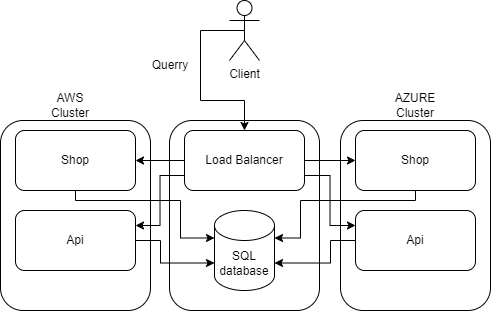
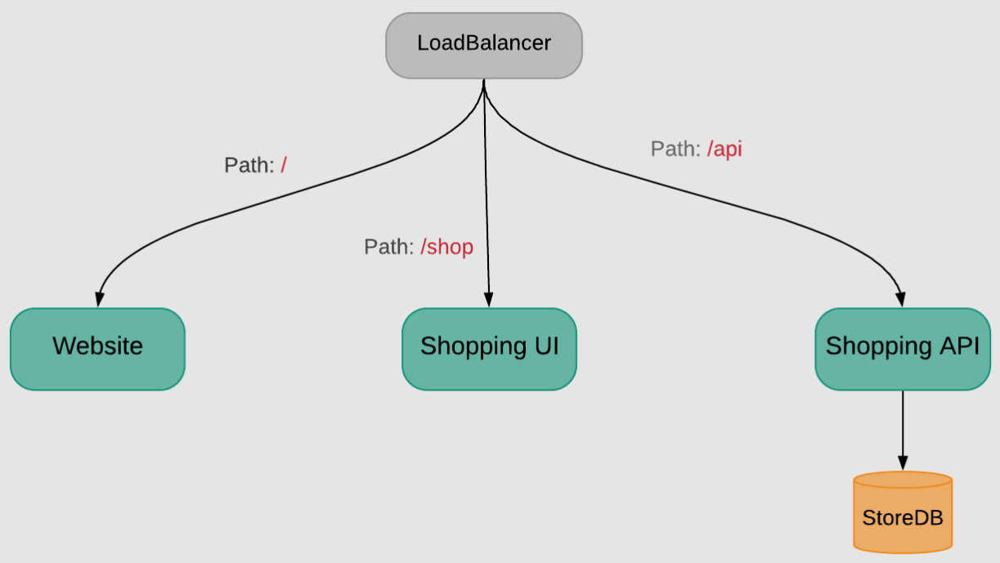

# Architecture

## Solution architecture

Architecture of OCM deployment and bookstore service.

 

The center of infrastructure is a server that acts as **Main Hub**.
The server consists of **OCM Hub Cluster**, **load balancer**
and **database**.
OCM Hub Cluster is responsible for managing all the clusters in the infrastructure.
Every other cluster will be connected to the hub's
database that will store book data.
Load Balancer will distrbute traffic across all the clusters and
provide access only to active services.

Bookstore will be hosted on 2 clusters - **AWS** and **Azure**. Each
cluster provides **main bookstore page**, **shopping page** - list or
preview books, and **API** - manage books in database. To simplify demonstration, API will not have any authentication.

Local bookstore deployment architecture.

 

These three components provides following functionalities that can be tested
(but do not need to be) by using OCM:
* ease of tracking webpage changes (migrations)
* having access to the same data from different clusters (changing functionality)
* an api that supports GET and POST methods to manage the same data (changing data structure)

## Technology

The bookstore applications responsible for webpage, shop and API are written in **Ruby** and **Vue.js**. **NGINX** will take over as the load balancer, while the database will be **MySQL**.

Every component or service in the infrastructure is containerized and
can be managed by OCM.

In addition, tools such as **Docker** or **Make** will be used during development to build or test individual services and simulate
infrastructure environment on a local workstation.

## Bookstore

Code: https://github.com/devteds/demo-app-bookstore