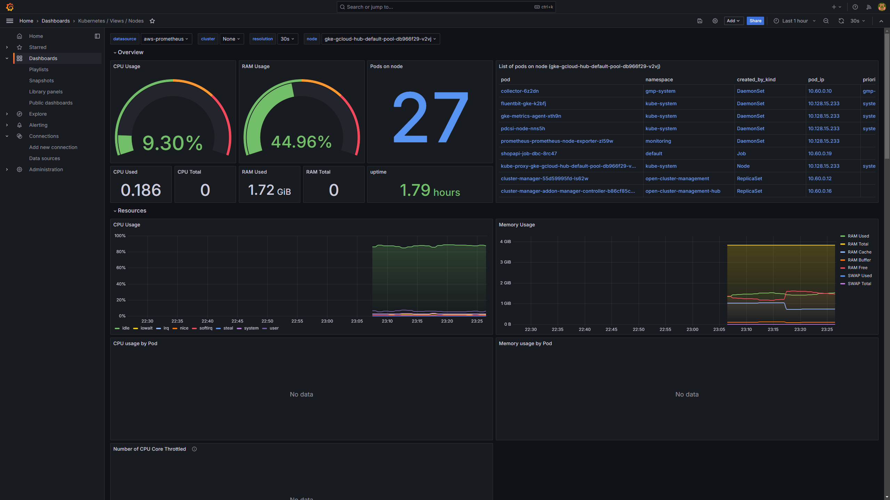
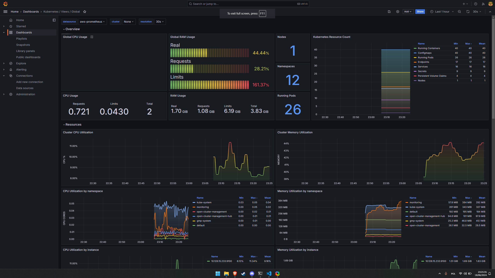
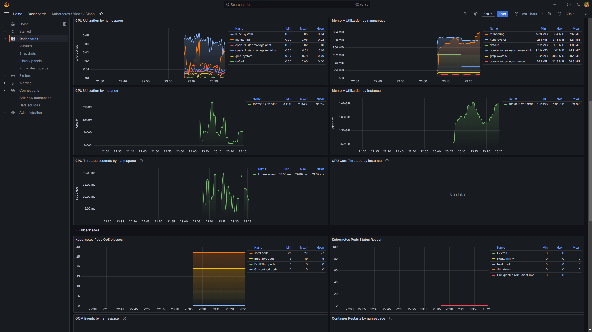

# Deployment step by step

In this chapter the logs and console outputs that appear during initialization process willl be shown.

## Application clusters

Before the OCM is used, we tested the infrastructure deployed manually. They are set up as in [chapter 6](06_installation.md). After initializing the application clusters on AWS and Azure we can see the services they provide. Note that, because the main cluster is used as a proxy none of the services have any external IP address.

Here is the main cluster, that hosts database and loadbalancer. It serves as an access point to the application.

## Setting up OCM

After creating clusters it is time to set up OCM.  The script "initialize_ocm.sh" will initialize hub cluster and join klusterlets that are passed as the script's arguments. Here is the output after a succesful execution.

After successful execution, the managed clusters can be displayed.

## Manifestwork

At last we applied the manifestwork onto the hub cluster to check if the application will be deployed on the application clusters. After shutting down the application manually on aws cluster and applying the ocm_appcluster.yaml file, all services have been successfully deployed. 

## Observability

After deploying Prometheus and Grafana on the cluster we were able to observe how the infrastructure works:

