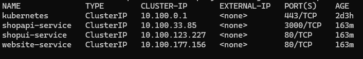
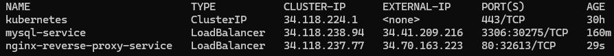
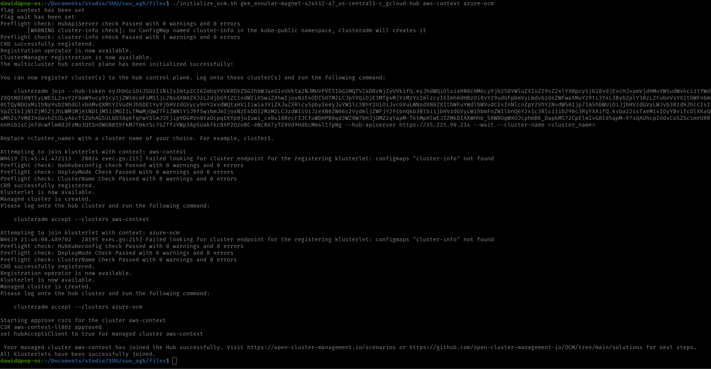
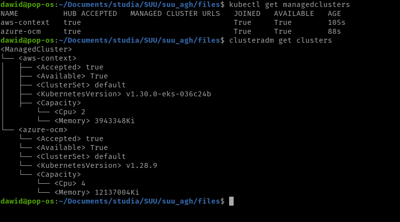

# deployment step by step

## Clusters with applications

After initializing the application clusters on AWS and Azure we can see the services they provide.

Here is the main cluster, that hosts database and loadbalancer.

## Setting up OCM

After creating clusters it is time to set up OCM.  The script "initialize_ocm.sh" will initialize hub cluster and then it will join it to the klusterlets that are passed as the script's arguments. Here is the output after a succesful execution.

After successful execution, the clusters will look like this.

## Features to test

- One of the features that had been planned to be tested was the availability. OCM provides several strategies in case of cluster shutdown. Theoretically it is able to reroute traffic or automatically detect and trigger recovery process, all of that to keep services aveilable and minimalize downtime.
- OCM gives access to a quick way to setup multiple copies of clusters using Manifest. This feature would provide the application with a good scalability.
- Additionally OCM helps also with migrations to newer versions of the application. It can select clusters based on resource aveilability and deployment policies to also minimalize downtime of the services.

due to issues with OCM these features couldn't be tested properly.